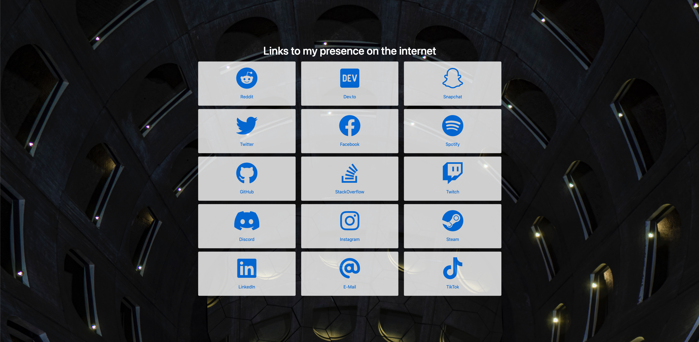

> [!IMPORTANT]
> This repo has been archived as I've moved the content to my [personal homepage][0] instead.
>
> Feel free to visit the [website itself][0] or [the repo][1] that contains the source code.

   

# 4lch4.social

This repo is the home of my socials landing page, with links to my accounts/presence online. It's a simple website created with [Hugo][2] and the [Bootstrap BP Hugo Startpage][3] theme. Instead of using the theme as is, I've [created a fork][4] where I maintain it myself.

## Acknowledgements

- [Hugo][2] - Framework used to build the website.
- [Bootstrap BP Hugo Startpage][3] - The theme used for styling the website.
- [FontAwesome][5] - Provides the icons for the various services/sites.

## Screenshot

[0]: https://4lch4.com
[1]: https://github.com/4lch4/4lch4.com
[2]: https://gohugo.io
[3]: https://themes.gohugo.io/themes/bootstrap-bp-hugo-startpage
[4]: https://github.com/4lch4/bootstrap-bp-hugo-startpage
[5]: https://fontawesome.com
